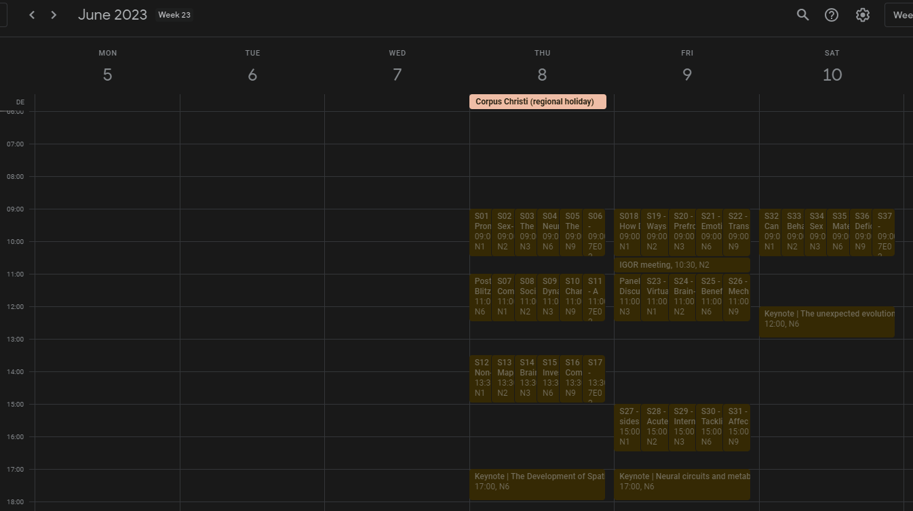

 

  

  <h3 align="center">PuG 2023 Google Calendar</h3>

  

    A repository for the Google calendar implementation of PuG2023's programme
  

### pug23Cal

Works only for PuG23 :)
Reads the PuG23 program from the PDF and pushes the events into a GCal where you can subscribe and follow from your apps!

## Built With

Until now, I've developed everything with Python; and some wrappers

## Contributing

Contributions are what make the open source community such an amazing place to be learn, inspire, and create. Any contributions you make are **greatly appreciated**.

- If you have suggestions for adding or removing projects, feel free to [open an issue](https://github.com/caggursoy/phdSideQuests/issues/new) to discuss it, or directly create a pull request after you edit the _README.md_ file with necessary changes.
- Please make sure you check your spelling and grammar.
- Create individual PR for each suggestion.
- Please also read through the [Code Of Conduct](https://github.com/caggursoy/phdSideQuests/blob/main/CODE_OF_CONDUCT.md) before posting your first idea as well.

### Creating A Pull Request

1. Fork the Project
2. Create your Feature Branch (`git checkout -b feature/AmazingFeature`)
3. Commit your Changes (`git commit -m 'Add some AmazingFeature'`)
4. Push to the Branch (`git push origin feature/AmazingFeature`)
5. Open a Pull Request

## License

Distributed under the unlicense. See [LICENSE](https://github.com/caggursoy/phdSideQuests/blob/main/LICENSE.md) for more information.

## Authors

- **Çağatay Gürsoy** - _Neurobiology PhD researcher_ - [Çağatay Gürsoy](https://github.com/caggursoy) - \*\*
