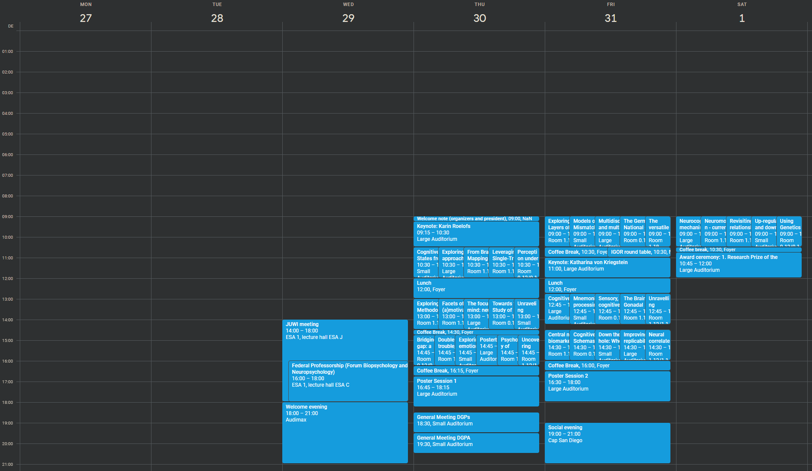

 

  

  <h3 align="center">PuG 2024 Google Calendar</h3>

  

    A repository for the Google calendar implementation of PuG2024's programme
  

# PuG24Cal

Works only for PuG24 :)
Reads the PuG24 program from the PDF and pushes the events into a GCal where you can subscribe and follow from your apps!

## Importing the original (read-only) calendar

- Just click this link and it should be automatically added to your Google Calendar
  - [Link](https://calendar.google.com/calendar/u/0?cid=Y2Q3YWY2OWZlYTA0ZTQwYWIxZThkYzI1MTMzNGEzODVmZGVhNGU5NzIzNGEyZWJhOWU4M2YzMzgzNDYzYzlhZUBncm91cC5jYWxlbmRhci5nb29nbGUuY29t)

## Duplicating and creating your own calendar

If you want to personalise your own calendar by removing some of the sessions from the whole calendar, you can follow the steps below to duplicate the calendar and create your own

### Step 1: Export the Calendar

1. **Open Google Calendar**:

   - Go to [Google Calendar](https://calendar.google.com).

2. **Go to Settings**:

   - Click on the gear icon in the top-right corner and select `Settings`.

3. **Select Calendar to Export**:

   - In the left sidebar, click on `PuG24-Calendar` under the `Settings for my calendars` section.

4. **Export Calendar**:
   - Click on `Export calendar` under the `Calendar settings` immedietaly below `Time zone` setting
   - This will download a ZIP file containing an `.ics` file of your calendar.

### Step 2: Create a New Calendar

1. **Go to Google Calendar**:

   - If you're not already there, go back to [Google Calendar](https://calendar.google.com).

2. **Create a New Calendar**:
   - Click on the `+` icon next to `Other calendars` on the left sidebar.
   - Select `Create new calendar`.
   - Fill in the details for your new calendar and click `Create calendar`.

### Step 3: Import the Calendar

1. **Go to Settings**:

   - Click on the gear icon in the top-right corner and select `Settings`.

2. **Select Import & Export**:

   - In the left sidebar, click on `Import & export`.

3. **Import the .ics File**:
   - In the `Import` section, click on `Select file from your computer`.
   - Choose the `.ics` file you exported earlier.
   - In the `Add to calendar` drop-down menu, select the new calendar you created in the previous step.
   - Click `Import`.

Your new calendar should now contain all the events from the original calendar.
Now you can uncheck the original `PuG24-Calendar` from the `My calendars` panel and start editing your own instance.

## Built With

Until now, I've developed everything with Python; and some wrappers

## Contributing

Contributions are what make the open source community such an amazing place to be learn, inspire, and create. Any contributions you make are **greatly appreciated**.

- If you have suggestions for adding or removing projects, feel free to [open an issue](https://github.com/caggursoy/phdSideQuests/issues/new) to discuss it, or directly create a pull request after you edit the _README.md_ file with necessary changes.
- Please make sure you check your spelling and grammar.
- Create individual PR for each suggestion.
- Please also read through the [Code Of Conduct](https://github.com/caggursoy/phdSideQuests/blob/main/CODE_OF_CONDUCT.md) before posting your first idea as well.

### Creating A Pull Request

1. Fork the Project
2. Create your Feature Branch (`git checkout -b feature/AmazingFeature`)
3. Commit your Changes (`git commit -m 'Add some AmazingFeature'`)
4. Push to the Branch (`git push origin feature/AmazingFeature`)
5. Open a Pull Request

## License

Distributed under the unlicense. See [LICENSE](https://github.com/caggursoy/phdSideQuests/blob/main/LICENSE.md) for more information.

## Authors

- **Çağatay Gürsoy** - _Neurobiology PhD researcher_ - [Çağatay Gürsoy](https://github.com/caggursoy) - \*\*
